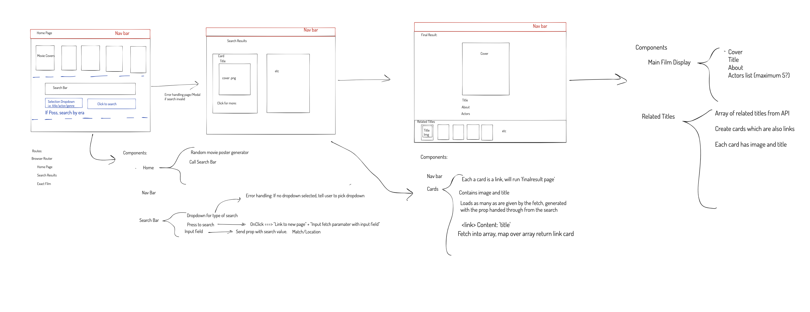

## General Assembly Project 2 

# **Film_Finder**

The Developers:

Clement Knox and Joseph Schenk

Timeframe: 

48 hours

The Goal:

This project was the outcome of a 48-hour pair-progamming hackathon where we were charged with using React, React-Router, and RESTful APIs to build a multi-page app of our choice. To complete the project we would have to host the repository on Github and deploy the application somewhere on the internet before the deadline passed. 

The Technologies Used:

* HTML5 
* JavaScript (ES6)
* Git
* GitHub
* SASS
* Bulma
* React
* React-Router
* RESTful APIs
* Lodash
* Axios

The App:

*Film_Finder* is a simple app built with React and making use of RESTful APIs that allows the user to search for films either by title or by actor. The app will accept search terms and then produce a film for the user on the basis of the search term. The outcome will be a single page with some information about the film and some suggestions for related films that the user might be interested in.

Use the deployed version here: [deployedversion](https://josephschenk.com/project-2/)

At Clement's Github:
[https://clem-code.github.io/project-2/](https://clem-code.github.io/project-2/)
or at Joseph's Github:
[https://JSchenk8.github.io/project-2/](https://JSchenk8.github.io/project-2/)

## Building *Film-Finder*

### _Planning_

We spent a long time planning out this app and that was definitely time well-spent. Together we chewed over the choice of API for several hours and once we'd selected one Joseph made extensive plans using Ziteboard. Choosing the right API was clearly key to the success of the project. We wanted to make something fun and useful but also use technologies that would allow us to experiment with our knowledge of React, React-Router, and APIs (at this point we'd only been learning about all of these things for 10 days!). We selected the Movie DB API, both because it was comprehensive and therefore a useful resource for the user but also complex enough in its documentation that it would test us as programmers! But we also decided early on that we would try and pair this API with other, related APIs, and quickly settled on the idea of using the New York Times' film review API to find matching reviews for the films our user searched for.

Once we'd selected an API we planned out the flow of our app. As one of the requirements was that it would have several pages we created a flowchart that represented the different stages of the App.

It looked like this:

 

In essence we would have 4 pages and a navbar that appeared on all of the pages.

In our code it eventually looked like this:

	const App = () => (
	  <BrowserRouter >
	    <NavBar />
	    <Switch>
	      <Route exact path="/project-2/" component={Home} />
	      <Route exact path="/project-2/search" component={Search} />
	      <Route exact path="/project-2/result" component={Result} />
	      <Route exact path="/project-2/about" component={About} />
	    </Switch>
	  </BrowserRouter >
	)

### _Coding_

<b>
Pair Programming
</b>

This project was as much about testing our capacity to work as a team as it was about our coding skills. Whilst we had been working collaboratively throughout the course, this was our first time pair-programming full-time on a project and seeing it through together from conception to deployment. Due to the COVID 19 pandemic, the entire boot camp was taking place remotely and so naturally we were pair-programming remotely as well. Throughout, Clement was in London and Joseph was in Sussex. We were in contact via Slack and Zoom. Additionally, we'd set up the Visual Studio Code's Live Share functionality. However, we quickly found out that this was <i>very</i> laggy and so we made the decision that one of us would do the typing while the other watched and guided via Zoom screenshare.

<b>
The Home Page
</b>

The home page is at the heart of the app. It's where the user makes the initial decision about what they want to look for. We kept it very simple. Upon arriving at the home page the user finds a search bar and a drop down menu with two choice: 'Title' or 'Actor'. If the user selects 'Title' and searches for 'Matrix' they will be shown all films with 'Matrix' in the title. If they select 'Actor' and search for 'Tom Cruise' they will be shown films starring Tom Cruise. 

Under the hood, the code looked like this:

	function Search() {
	  const [input, updateInput] = useState('')
	  const [option, updateOption] = useState('title')
	  useEffect(() => {
	  }, [input])
	  
	  return 

	    

	      

	        <input className='input is-rounded p-2' id='input-size' onKeyUp={(event) => updateInput(event.target.value)} type='text' placeholder='What are you searching for?' />
	      

	      

	        <select onChange={(event) => updateOption(event.target.value)} >
	          <option value='Title'>Title</option>
	          <option value='Actor'>Actor</option>
	        </select>
	      

	      <Link to={{
	        pathname: '/project-2/search/',
	        state: { optionState: option, inputState: input }
	      }}  ><button className='button is-rounded m-2'>Search!</button></Link>
	    

	  

	}

In essence, this code involves two pieces of state, input and option, which record whether the user is searching for an actor or a title ('option') and what their search term is ('input'). The tricky part involves sending this information to the next page where the results will be displayed. The code that transmitted that information was this part, using a React-Router Link:

	<Link to={{
		        pathname: '/project-2/search/',
		        state: { optionState: option, inputState: input }
		      }}  ><button className='button is-rounded m-2'>Search!</button></Link>

Getting this part to work was one of the first real challenges we had. It took a couple of hours and much scouring of the React-Router documentation, but we got there in the end!

To decorate the page we used a fetch request to grab 12 movie posters from the Movie DB API and had them in the background. Everytime the page reloads another set of 12 will be selected, keeping it looking fresh!

The code looked like this:

	const [moviePosterURLs, updatemoviePosterURLs] = useState([])

	  useEffect(() => {
	    axios.get(`https://api.themoviedb.org/3/movie/popular?page=${Math.floor(Math.random() * 500) + 1}&api_key=${process.env.apikey}`)
	      .then(({ data }) => {
	        updatemoviePosterURLs(data.results.slice(0, 12))
	        console.log(data)
	        console.log(data.results)
	
	      })
	  }, [])
 
<b>
The Search Page
</b>

On the surface, the search page looks pretty straightforward: it simply shows the results that match search made on the home page. However, due to how the API worked, fetching movies by title and by actor produced slightly different data. A major part of coding the search page was in managing this difference in order to create separate fetch requests depending on whether the user searched for an actor or a title.

The first part of this was creating a function that found out whether the user had searched for a title or an actor:

	  function declareOption() {
	    if (location.state.optionState === 'title') {
	      return 'movie'
	    } else {
	      return 'person'
	    }
	  }
  
  Then using that to generate fetch requests:
  
	  const option = declareOption()
	  useEffect(() => {

    if (option === 'movie') {
      axios.get(`https://api.themoviedb.org/3/search/${option}?query=${input}&api_key=${process.env.apikey}`)
        .then(({ data }) => {
          if (data.results.length === 0) {
            updateResults(['error'])
          } else {
            updateResults(data.results)
          }

        })
    }
    if (option === 'person') {
      axios.get(`https://api.themoviedb.org/3/search/${option}?query=${input}&api_key=${process.env.apikey}`)
        .then(({ data }) => {
          if (data.results.length === 0) {
            updateResults(['error'])
          } else {
            updateResults(data.results)
            updateActorID(data.results[0].id)
          }
        })
    }

  }, [])
  
  If the search was for an actor then the following additional fetch request would be made:
  
	  useEffect(() => {
	
	    axios.get(`https://api.themoviedb.org/3/person/${actorID}/movie_credits?api_key=${process.env.apikey}`)
	      .then(({ data }) => {
	        updateResults(data.cast.slice(0, 19))
	        console.log(data)
	        console.log(data.cast.slice(0, 19))
	      })
	  }, [actorID])

Then the results were displayed! 

To keep things simple the results were represented just as a series of posters. Here we used React-Router again to turn each poster into a Link which took the user through to the next page:

	<Link to={result === 'error' ? { pathname: '/project-2/' } : {
	          pathname: '/project-2/result/',
	          state: { resultState: result.id }
	        }} >

We also added some error handling here as well. If the search produced nothing this gif would show, which when clicked would link back to the home page:

 

<b>
The Results Page
</b>

Beneath the surface, the entire point of the search page was to find a unique film ID that we could feed to the API on the very last page: the results page. Once the user clicks on a poster they send that film's unique ID through to the results page which produce the result. For instance, if they were looking for <i>Good Will Hunting</i> they would come to this page:

 

As you can see, we incorporated the New York Times' movie review API here. We kept it simple, showing the user the short summary and then providing a link through to the whole article.

	 function getReview(filmName) {

	    axios.get(`https://api.nytimes.com/svc/movies/v2/reviews/search.json?query=${filmName}&api-key=${process.env.nytapikey}
	    `)
	      .then(({ data }) => {
	        if (!data.results) {
	          updateFilmReview({
	            link: {
	              url: ''
	            }
	          })
	        } else {
	          updateFilmReview(_.reverse(data.results)[0])
	        }
	      })
	  }

One small problem we encountered here was that if you searched for 'Home Alone' the NYT API would return all films with Home Alone in the title in descending order of release date. In other words, the original <i>Home Alone</i> would be shown last! We side-stepped around this by using a Lodash array function to reverse the order and then select the first review in the reversed array! We found this worked fine, because the problem was confined to the first film in a series. If you were looking for <i>Home Alone 2</i>, the NYT API would always show you the relevant review. 

Below the result we displayed twenty similar movies, using data grabbed from the Movie DB API. We were actually very impressed by how accurate some of these were! We also added some simple code so that if you clicked on one of these posters if would update the page to show you the information about that film.

 
 

### _Design_

By consensus we took a 'less is more' approach to design. One of the cool things about using a film database was that the movie posters fetched from the API did a lot of the hard work of making the page look great! In general, we allowed the posters to speak for themselves and kept to a simple, symmetrical aesthetic which used white as the primary colour and made use of shading to add texture to the interface.

We did make one important design decision however: we wanted to use Bulma throughout. We both felt pretty comfortable using vanilla HTML and CSS to style a page so by using Bulma we were pushing ourselves a bit out of our comfort zone. 

How did we find it?

Well, Bulma made the styling quite easy. We liked the colour schemes and the dimensions that Bulma provided. In terms of the code, it meant <i>a lot</i> of close-reading of the Bulma documentation, usually with one person reading the docs aloud and the other coding out their instructions! In terms of challenges, using Bulma meant having to do the layout the Bulma way, which, again, took us out of Flex-Box comfort zone, but in the end made the app look great.

Finally, we made use of Bulma to add some responsive features to our home page:

	  const createRandomMoviePosters = () => {
	    return moviePosterURLs.map((movie, index) => {
	
	      return 

	        

	          

	            <figure className='image is-2by3'>
	              
	            </figure>
	          

	        

	      

	    })
	  }
	  
Also, you can see in here we added some light animation through the 'grow' and 'grow2' classes to bring the page alive a bit. We tried to keep animation the same (and similarly unintrusive) across the app to make the user journey feel consistent.

  
### _Conclusion_

<b>
Wins
</b>

* The pair-programming went smoothly and we had a lot of fun in the process. It was the first time doing it for both of us and we had a great experience!
* We were both really pleased with the visual appearance of the app: it was clean, functional, and easy to navigate.
* We were also really satisfied with our code. We spent a lot of time making it as lean and pared down as possible and that paid off: there wasn't a single component longer than 100 lines of code!

<b>
Challenges
</b>
* Getting React-Router to pass props across pages the first-time was a real challenge -- but once we cracked it was pretty easy to use.
* Using Bulma to layout our pages raised some interesting problems, but it made us really familiar with the documentation which was a good thing.
* The NYT API threw up some interesting bugs -- for a while it would only show the short summary for an Iranian vampire film!

<b>
What We Could Add
</b>

* If we had more time we would have added video player functionality  on the results page so we could show the film trailers.
* We were going to add some more animation to the home page so the film posters would update -- but we ran out of time!
* Likewise, we wanted to add more search parameters (genre and decade were two obvious ones).

